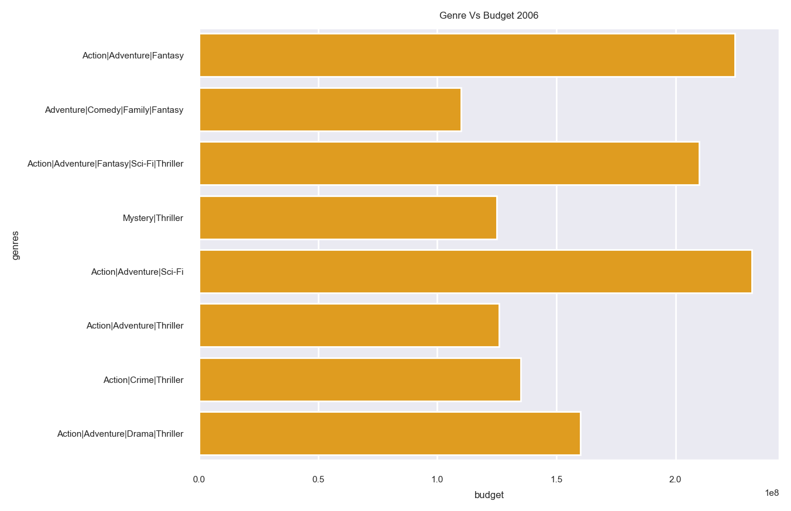

# Introduction
Our project was exploring details involving film production and the methods used in modern practices. The dataset we used was an overview of the top films released each year with the details involved in the production. Initially we chose this dataset mainly because we were very keen to look into more details involving the film industry. However, we actually found out a lot of new interesting things while analyzing this dataset, and this would most likely be very interesting to many other people.
# Exploratory Data Analysis

# Questions:

## Talon Lusk: Question + Results
[Link](notebooks/analysis1.ipynb)
## Jordan Roberts: Question + Results
### Was the Switch of Film Production Format Caused by a Change in Cost?

This figure shows the average budget of the top films over time.
This figure does clearly show a decrese in the average budget of digitally produced films.

This figure shows the amount of films produced from 2006-2016. This figure is important because it shows the year ranges where we should focus. 2010-2014 is the range where the change from Film to Digital.

This figure shows the amount of films produced at each budget level. This one on it's own nearly answers the question on its own.

### Overall I don't think these plots answer the question on its own, I do think it shows correlation between the budget and film type chosen. However this may be more associated with the availability of comparitive technologies on the digital side.

[Full Analysis Here](notebooks/analysis1.ipynb)
## Jordan Pohr: Question + Results
### Does a Genre Impact a Films Budget? and How Have Film Budgets Changed Over Time?

This visualization shows how the budget of films has changed over the time period of 2006-2017.
We can see budget hasn't changed much overall from year to year.

This visualization shows the top budgets of genres in 2006 (over 150 million).We can see that 
Action movies are dominate in terms of budget compared to others. 

This visualization shows the top budgets of genres in 2017(over 150 million). Once 
again we can see Action is the dominate genre in terms of budget. 

[Full Analysis Here](notebooks/analysis3.ipynb)

### These plots shows the impact on a films genre on its budget, as well how budgets have changed over time. The first plot shows how much budgets have changed over time and we can see overall film budgets have stayed relatively the same on average, we can see in some years where very high budget films came out but on average they are roughly the same. In the Genre vs Budgets for 2006 and 2017, we can see a correlation with the highest budget films and there genres(over 150 million in budget). The main genre for the highest budget films are Action films, although there are some outliers, for the most part the films are Action films. they may have different sub genres but the main genre of is Action. We can infact see a genre does impact a films budget, Action films for the most part have the highest budgets compared other genres. 

[Full Analysis Here](notebooks/analysis3.ipynb)
# Summary/Conclusion: 
### This dataset provided alot of useful data in our analysis of the film industry. We found correlations between budget and film types as well as budget and genres. We found correlations between a films type and its genre as well. We learned alot of interesting things about the film industry working with dataset, for instance we looked at budgets quite frequently which helped us gain an understanding of how much these films cost to make and how that affects their production as well how it affects the audience they are trying to catter too. 