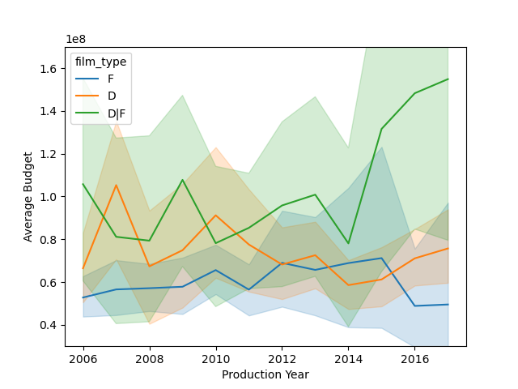
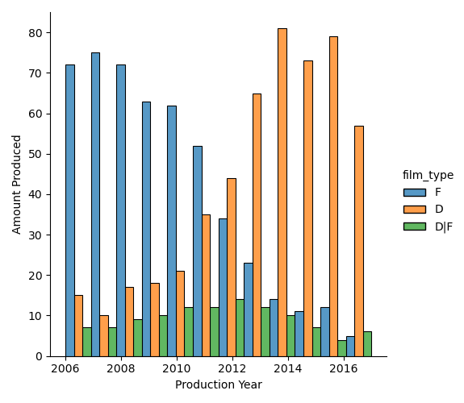
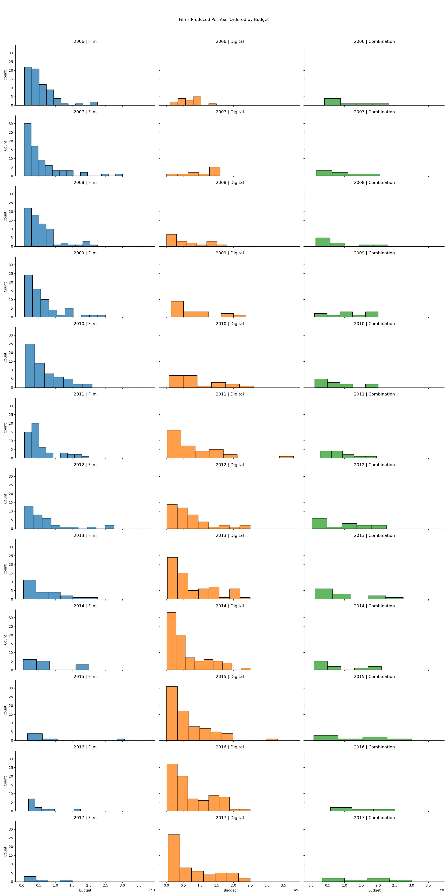

# Introduction
Our project was exploring details involving film production and the methods used in modern practices. The dataset we used was an overview of the top films released each year with the details involved in the production. Initially we chose this dataset mainly because we were very keen to look into more details involving the film industry. However, we actually found out a lot of new interesting things while analyzing this dataset, and this would most likely be very interesting to many other people.
# Exploratory Data Analysis

# Questions:

## Talon Lusk: Question + Results
[Link](notebooks/analysis1.ipynb)
## Jordan Roberts: Question + Results
### Was the Switch of Film Production Format Caused by a Change in Cost?

This figure shows the average budget of the top films over time.
This figure does clearly show a decrese in the average budget of digitally produced films.

This figure shows the amount of films produced from 2006-2016. This figure is important because it shows the year ranges where we should focus. 2010-2014 is the range where the change from Film to Digital.

This figure shows the amount of films produced at each budget level. This one on it's own nearly answers the question on its own.

### Overall I don't think these plots answer the question on its own, I do think it shows correlation between the budget and film type chosen. However this may be more associated with the availability of comparitive technologies on the digital side.

[Full Analysis Here](notebooks/analysis1.ipynb)
## Jordan Pohr: Question + Results

# Summary/Conclusion: 